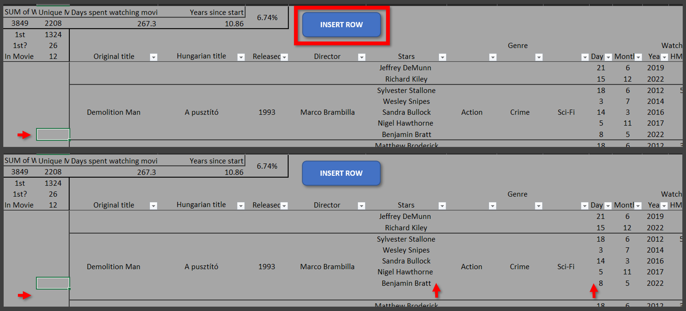
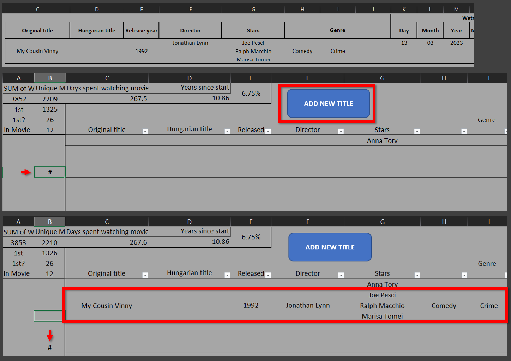

# VBA - learn & archive

## Insert a row, relocate old values, get a clean new row
- Inserts a row in the `ActiveCell`s line
- Moves the old value(s) up by one cell

<div align="center">
     
</div>

```
Sub InsertRow_Active_Cell()
    
    ''' INSERT A NEW ROW
    ActiveCell.EntireRow.Insert
    
    ''' STARS - RELOCATE OLD VALUE
    Cell_Star_New = "G" & ActiveCell.Row + 1
    
    Range(Cell_Star_New).Offset(-1, 0) = Range(Cell_Star_New).Value
    Range(Cell_Star_New).Value = None
    
    ''' DATE - RELOCATE OLD VALUES
    New_Row_Value = ActiveCell.Row + 1
    Date_New_Range = "K" & New_Row_Value & ":" & "M" & New_Row_Value
    
    Range(Date_New_Range).Offset(-1, 0) = Range(Date_New_Range).Value
    Range(Date_New_Range).Value = None
    

End Sub
```

## Copy values from a different workbook
- Workbooks needs to be opened (in this case)
- Moves the indicator(#) down for the next record
- According to the `ActiveCell` copies the new title details
- Merged cell as the `ActiveCell` can be problematic (`Offset` behave differently for merged and default cells when you try to copy them together (as `.value` or with `copy/paste`))

<div align="center">
     
</div>

```
Sub Copy_New_Title()

ActiveCell.Offset(3, 0).Value = ActiveCell.Value

Workbooks("Movies.xlsm").Worksheets("Movies").Range(ActiveCell, ActiveCell.Offset(-2, 16)).Value = Workbooks("Movies_New_Record.xlsx").Worksheets("New Record").Range("B3:R5").Value

End Sub
```


