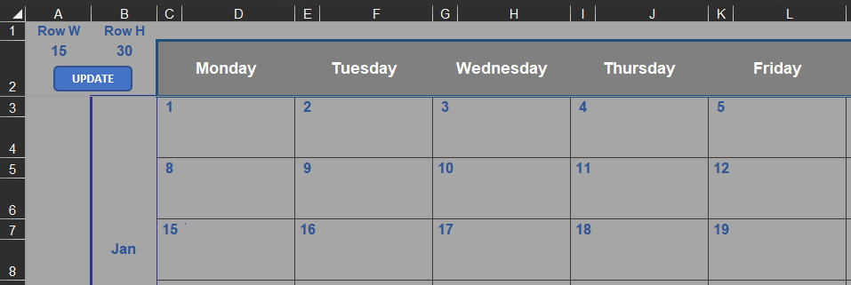

# VBA - learn & archive

## Insert a row, relocate old values, add the date of the day
- Inserts a row in the `ActiveCell`s line
- Moves the old value(s) up by one cell (star, date)
- Adds the the current day, month, year in the "new" row

<div align="center">
     
</div>

```
Sub Insert_Row()
    
    ''' INSERT ROW
    ActiveCell.EntireRow.Insert
    
    ''' STARS - RELOCATE
    ActiveCell.Offset(0, 5) = ActiveCell.Offset(1, 5)
    ActiveCell.Offset(1, 5) = None
    
        '' SOLUTION #2 - RANGE COMPILING
        'Cell_Star_New = "G" & ActiveCell.Row + 1
        'Range(Cell_Star_New).Offset(-1, 0) = Range(Cell_Star_New).Value
        'Range(Cell_Star_New).Value = None
    
    ''' DATE - RELOCATE
    Range(ActiveCell.Offset(0, 9), ActiveCell.Offset(0, 11)).Value = Range(ActiveCell.Offset(1, 9), ActiveCell.Offset(1, 11)).Value
    Range(ActiveCell.Offset(1, 9), ActiveCell.Offset(1, 11)).Value = None
    
        '' SOLUTION #2 - RANGE COMPILING
        'New_Row_Value = ActiveCell.Row + 1
        'Date_New_Range = "K" & New_Row_Value & ":" & "M" & New_Row_Value
        'Range(Date_New_Range).Offset(-1, 0) = Range(Date_New_Range).Value
        'Range(Date_New_Range).Value = None
    
    ''' DATE - ADD TODAY`S
    ActiveCell.Offset(1, 9) = Format(Date, "dd")
    ActiveCell.Offset(1, 10) = Format(Date, "mm")
    ActiveCell.Offset(1, 11) = Format(Date, "yyyy")

End Sub
```

## Copy values from a different workbook
- Workbooks needs to be opened (in this case)
- Moves the indicator(#) down for the next record
- According to the `ActiveCell` copies the new title details
- Merged cell as the `ActiveCell` can be problematic (`Offset` behave differently for merged and default cells when you try to copy them together (as `.value` or with `copy/paste`))

<div align="center">
     
</div>

```
Sub Copy_New_Title()

ActiveCell.Offset(3, 0).Value = ActiveCell.Value

Workbooks("Movies.xlsm").Worksheets("Movies").Range(ActiveCell, ActiveCell.Offset(-2, 16)).Value = Workbooks("Movies_New_Record.xlsx").Worksheets("New Record").Range("B3:R5").Value

''' Insert `How many times seen` formula
ActiveCell.Offset(-2, 12).Formula = "=COUNTA(" & ActiveCell.Offset(-2, 11).Address & ":" & ActiveCell.Offset(0, 11).Address & ")"

''' Merge `How many times seen` cells
Range(ActiveCell.Offset(-2, 12), ActiveCell.Offset(0, 12)).Merge

End Sub
```

## Update every 2nd column's width, row's height
<div align="center">
     
</div>

```
Sub Row_Column_update()
    
    'Row Height
    Dim i As Integer
    i = 4
    While i < 109
        Rows(i).RowHeight = Range("B2").Value
        i = i + 2
    Wend
    
    'Column Width
    i = 4
    While i < 18
        Columns(i).ColumnWidth = Range("A2").Value
        i = i + 2
    Wend
    
End Sub
```
